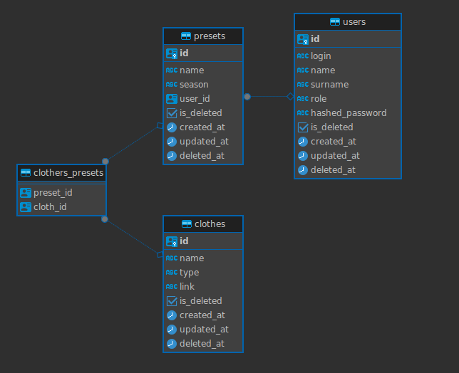

# Сервис для подбора одежды

## Идея

Приложение создано с целью создавать подборки одежды, где пользователь сможет сохранять, и просматривать свои пресеты одежды. Сохраняя свой стиль для разных сезонов, а также будет добавлена функция коммерческой подборки пресетов от стилистов.

## Дополнительная информация

Сервис представлен в каестве API.

## Техническая информация

Приложение было покрыто логами
Реальзован github CI workflow

### Структурная схема базы данных

### Маршруты и методы

| Route | Method | Description |
| ----- | ------ | ----------- |
| +text in green localhost:users/register | POST | Register user |
| +text in green localhost:users/login | POST | Login user |
| -text in red localhost:users/:id/presets | POST | Create preset |
| -text in red localhost:users/:id/presets | GET | Get all user`s presets |
| -text in red localhost:users/:id/presets/:id/clothes | POST | Create clothes |
| -text in red localhost:users/:id/presets/:id/clothes?season= | GET | Get clothes for season |
